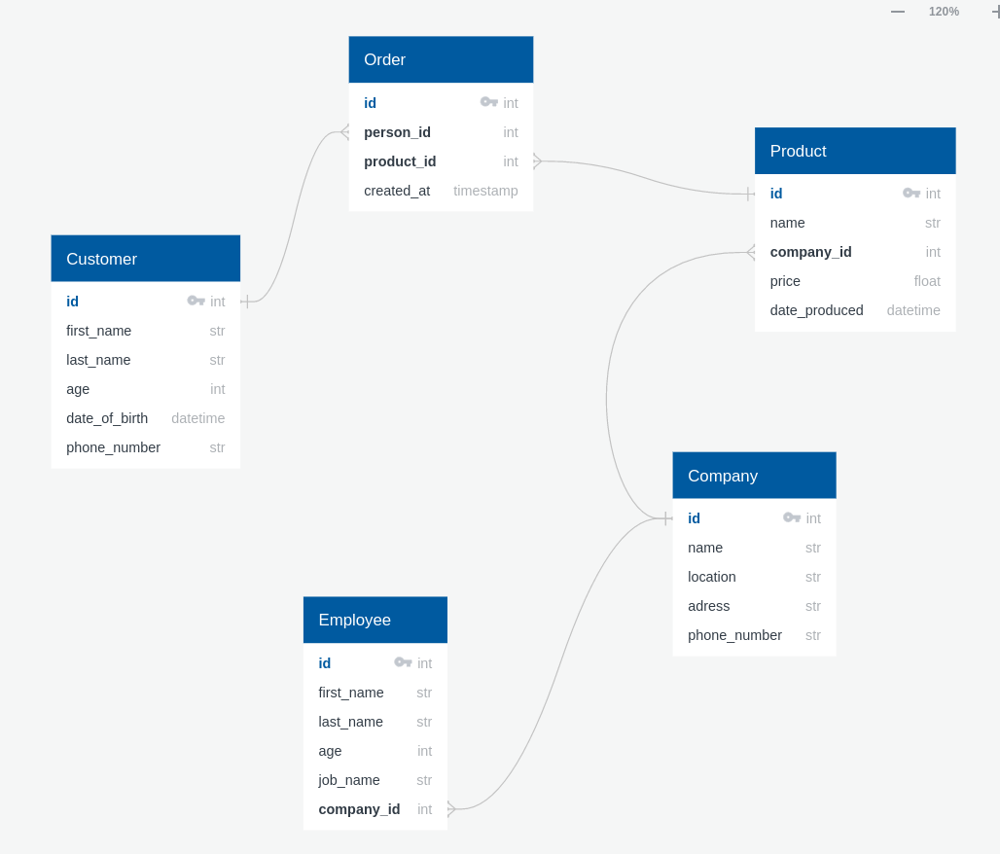

NUST MISIS GNOME SQUAD
----------------------
DATA HACK FAKER
===============

# Установка и запуск:  #
`git clone https://github.com/itatmisis/data-hack-faker.git`
`cd data-hack-faker/`
`docker compose up`
`docker compose run fake`
# Настройка дефолтных значений:  #
В `data-hack-faker/config` лежит `.json` файл для каждой таблицы соответственно. Изменяя поля в файлах можно изменить диапозоны значений и задать частоту генерируемых значений
~~~ json
   {
  "locale": "ru_RU", // локализация
  "rows": 10000, // количество выводимых строк
  "name": {
    "provider": "random_element",
    "kwargs": {
      "elements": {     //возможые элелементы с частотой распределения
        "ООО Альфа-Банк": 0.33,
        "ООО ПаркФайндер": 0.33,
        "ОАО Моя Оборона": 0.34
      }
    }
  },
  "phone": {
    "provider": "bothify",
    "kwargs": {
      "text": "8918#######" //маска для номеров телефона
    }
  }
}

~~~
# Структура "базы данных" #

